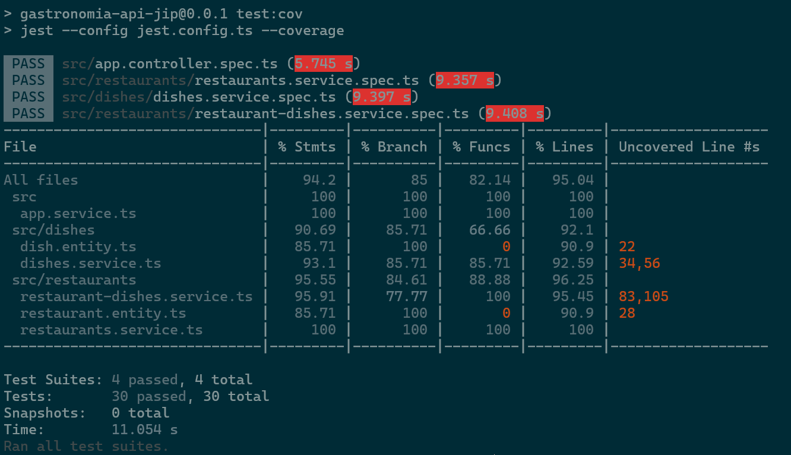
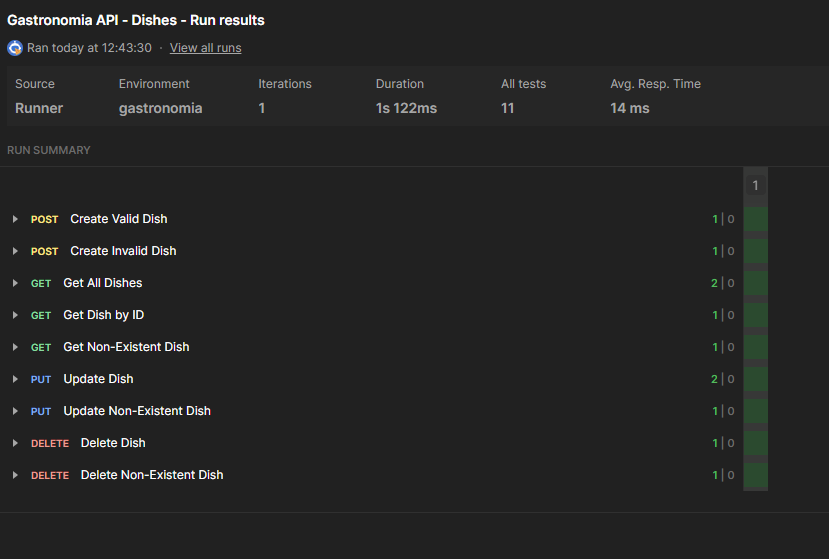
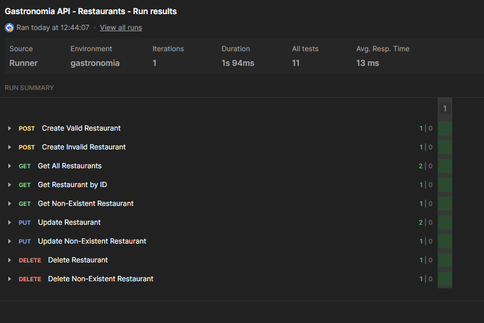
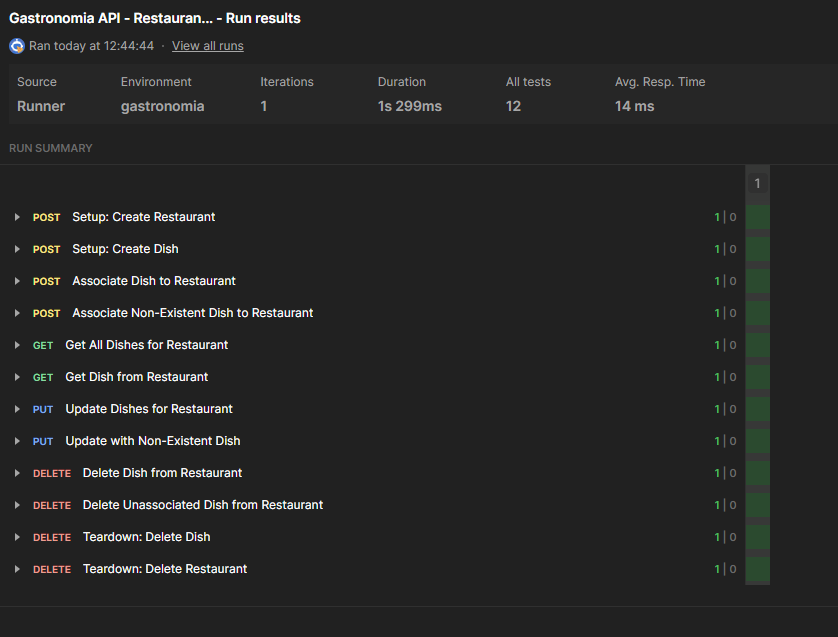

## Getting Started

### Prerequisites

- Docker & Docker Compose  
- Node.js (>= 16) & npm (or Yarn)  
- Git

---

### 1. Clone the repository

```bash
git clone git@github.com:JorgeIvanPuyo/gastronomia-api-jip.git
cd gastronomia-api-jip
```

### 2. Start the Postgres database

```bash
docker-compose up -d
```

This will start a `postgres:15` container with:

- Database: `gastronomia`  
- User/Password: `postgres` / `postgres`  
- Exposed port: `5432`

Verify it's running:

```bash
docker ps
# You should see 'gastronomia-postgres' in the list, status 'Up'
```

### 3. Install dependencies

```bash
npm install
# or, if you prefer Yarn:
# yarn install
```

### 4. Configure environment variables

Create a `.env` file in the project root (already gitignored) with:

```dotenv
DB_HOST=localhost
DB_PORT=5432
DB_USER=postgres
DB_PASS=postgres
DB_NAME=gastronomia
```

### 5. Run the application in development mode

```bash
npm run start:dev
```

By default, NestJS listens on port `3000`. You should see output similar to:

```
[Nest] XXXX   - 2025-05-16 09:00:00   [TypeOrmModule] Database connected
[Nest] XXXX   - 2025-05-16 09:00:00   [NestApplication] Nest application successfully started on port 3000
```

### 6. Verify the application is running

You can test the root endpoint:

```bash
curl http://localhost:3000/
# Expected output: "Hello World!"
```

### 7. Run Tests and Generate Coverage Report

To run the unit tests:

```bash
npm run test
```

To generate a test coverage report:

```bash
npm run test:cov
```  


This will run Jest with coverage enabled and output a report in the coverage/ directory.  

To view the HTML coverage report, open: `coverage/lcov-report/index.html` in your browser.

### 8. Running Postman Collections

All three Postman collections are located in the `collections/` folder at the root of the project:
- `Restaurants.postman_collection.json`
- `Dishes.postman_collection.json`
- `Restaurant-Dishes Full Flow.postman_collection.json`

Follow these steps to import and run them:

1. **Define the Postman Environment**
   - In Postman, go to **Environments** and **Create Environment**.
   - Add a variable:
     - **Key**: `base_url`
     - **Value**: `http://localhost:3000`
   - Save the environment (e.g. name it `Gastronomia`).

2. **Import Collections**
   - In the Postman sidebar, click **Import**.
   - Select **Import File** and choose each of the three `.json` files from `collections/`.

3. **Select the Environment**
   - From the top right, choose the `Gastronomia` environment so that `{{base_url}}` resolves correctly.

4. **Run a Collection**
   - Click the **Runner** icon (▶︎) in the top toolbar, or go to **New → Collection Runner**.
   - In the Collection Runner:
     - Select one of the imported collections.
     - Ensure the `Gastronomia` environment is selected.
     - Click **Run <Collection Name>**.
   - All requests and tests will execute in sequence.

5. **Review Results**
   - After the run finishes, you will see a summary of passed/failed tests and duration.
   - You can expand each request to view details.

  
  


---